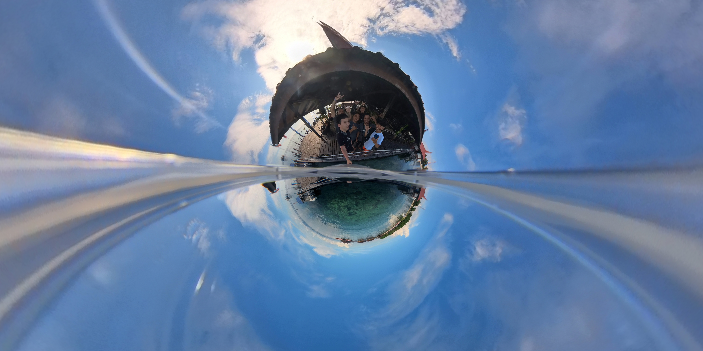

# 起因
最近工作上发生了变动（裁员），于是有了一段可以旅游的时间。想借此机会换个环境放松一下，同时也想感受下不同的文化。本来是想去日本但是自己没想清楚去干嘛，于是打算找个东南亚的国家游玩一下即使没有目的也能降低成本（毕竟失业了还是需要控制一下开支）。由于要离职所以有同事找我聊天，刚好聊到他要去马来西亚深潜，在了解到签证只需要48小时后，我就决定去马来西亚逛逛。

# 出发的准备
## 必要的物品
  - 护照 & 身份证
  - e-visa 电子签证 (通过飞猪代办)
  - 打印行程单 (入境时需要提供该材料)
  - 银联银行卡（用于入境后，在ATM上取该国现金）
  - 电话卡和手机 (飞猪直接购买了当地的电话卡并提前预约激活)
  - 插座装换头
  - 夏装 (热带国家每天都是夏天)
## 推荐的软件
  - Google Map(行程导航,找饭店,找景点)
  - Grab (外卖和打车,支持支付宝还挺方便)
  - 携程 (订机票和酒店)
  - 飞猪&支付宝
  - Airbnb (订民宿)
  - 小红书 (对景点或饭店有些参考的信息源)
# 衣食住行
旅行主旨: 随心，随性，不一定要去热门景点打卡，跟随自己的节奏。
## 行

**整个行程:** 
  北京 -> 吉隆坡(2days) -> 怡保(2days) -> 吉隆坡(2days) -> 仙本那(4days) -> 北京
### Landing
凌晨2点15分的航班从北京出发至8点30分到达吉隆坡，乘坐的是空客330大型机，整个飞行都比较平稳除了有一段雷阵雨的区域有些许颠簸。到达吉隆坡机场后，通过巴士去到中心城区。
### In Malaysia
在当地体验了三种交通方式:步行,地铁,轻轨,快艇,飞机。分别来讲一下我的主观感受: 
#### 步行
在吉隆坡步行时，会发现街上有响哄哄的摩托车，马路上的车速还挺快的。当要过马路时，会发现非常少的行人斑马线，我一般都是横穿马路通过挥挥手来示意司机让让我。
#### 地铁
体验了一下吉隆坡的地铁，整个地铁不是由一个单位运营的导致会有多个购票系统，多种地铁选择。让我觉得最不便的是换乘有时候需要出站去找附近另一个站，如果是一套系统的话直接就不需要出站了。
#### 轻轨
乘坐吉隆坡到怡保轻轨，感觉和国内的动车差不多，不知道是不是国内对外输出的产物。
#### 快艇

从仙本那镇上坐快艇到马步岛开启水上之旅，快艇开起来震动幅度还挺大的，但我却丝毫不害怕掉进水里和坐飞机的心态相比天差地别。

#### 飞机
从吉隆坡到斗湖的航班和从福州飞北京的距离差不多不过价格才315人民币也太便宜了。乘客安检比国内动车还松，行李草草过一遍安检扫描就通过了。

### Leaving

由于自己有一定程度的飞行恐惧，所以在出发前看了【飞行员之眼】的克服飞行恐惧。回北京需要先从斗湖机场飞到亚庇机场，再从亚庇机场飞到北京大兴机场。从斗湖飞往亚庇时，第一次体验能完整看到飞机的登机方式。整个斗湖机场非常小貌似只有四个登机口，航程不到一个小时就到亚庇。在亚庇机场刚好能看到当日的日落。由于天气的原因导致飞机晚点了一个小时。飞机伴随着雨点飞向天空，由于看了【飞行员之眼】所以了解到不少飞机的知识，飞机有多套备份系统来保证可用性，其次飞机的设计本身就考虑到恶劣天气的解决方案，飞机起飞中不断地暗示自己信任飞行员和飞机，加上途中打起来了塞尔达来转移注意力，发现打游戏对我来说是个消磨飞机旅程时间的不错方式。到了大兴机场感觉终于回到熟悉的环境，很安心，很放松哈哈哈。

## 住
### 酒店
在吉隆坡住了两个酒店都位于KLCC附近，第一个酒店是带有屋顶无边泳池，可以拥有高空视角观看夜晚的双子塔，酒店房间内有一股气味不是很喜欢，其他的都还行。第二个酒店是一个公寓型酒店也许是因为非国内节假日所以价格比较低，200+一晚上69平方米的公寓，为了把累计5天的衣服洗一洗，特地找了带洗衣机的酒店。在第二个酒店的时候，发生一件很尴尬的事情，晚上我想去看一下泳池，在泳池边上有几节台阶，由于灯光很暗导致我以为没有水就一只脚踏进了泳池里面，仅有的一双鞋的一只鞋湿了，回到公寓内后找了挂空调的小房间一晚上就把鞋子晾干了，幸好不然就没写啦。另外两个酒店都是通过携程预订的。整个体验来说性价比很高。
### 民宿

通过Airbnb订了怡保的民宿，民宿位于景区中心，好玩好看好吃的都在附近只需要步行。该民宿整体设计挺不错的，有些超预期的体验。
### 宿舍
仙本那-马步岛Scuba Junkie潜店宿舍

## 食
整个旅程不是特别在乎吃的东西，不过也算是吃到一些不错的美食。马来西亚的食物会偏甜，这点可以从当地的可口可乐上的配料表发现，当地的可乐每100ml的碳水化合物为14.7g而国内的大概在10g左右。在吉隆坡下机后的第一餐，不知道吃点什么就发现了有汉堡王就去吃了汉堡王整体来说还行，价格会比国内便宜一些。在吉隆坡到处都是商城整体感觉没啥意思，商城中都是连锁或者品牌店没有很本地的老店。直到出发去怡保，途中由于没赶上轻轨导致需要等下一班大概是16点的班次，于是有了段午餐的时间，从GoogleMap上打算找一家华人饭店，看到一家叫“好运来”评分挺高其次店名挺好的，毕竟在人生地不熟的情况下，希望好运来哈哈哈。
### 好运来
酥脆八爪鱼 + 大虾 + 福建米线

### 怡保美食
我分享一些在怡保印象还比较深刻的饭店和食物，另外老饭店对电子化都不是很热衷，一般只服务熟客所以在Grab外卖软件上基本没法点到餐。
#### 梁记猪杂粥
看了一下地图距离住的地方不是很远就打算走路，在路途中碰到有一段都是卖二手车的店和仓库，各个仓库都有恶狗看所，路过的时候被狗叫声不断，但是他们被关在仓库中就还好。直到碰到没有被关的狗，追了过来吓得我直接过马路去对面了，过完马路狗就没有追过来。我打起了打车的念头，一看就差几百米了，就鼓起勇气继续往前走了，幸运的时候路上再没遇到狗。回程的时候就直接打车了。到店之后店里没有具体的菜单需要看档口上些许菜品来点，就直接点了猪杂粥,鱼丸汤和凉茶，猪杂粥的猪杂没有异味对于一个不太能接受动物内脏异味的人来说还挺好吃的，其次粥中几乎没有完整的米粒和平时在家里和的粥还挺不一样的。鱼丸汤中的鱼丸很Q弹挺不错的。

####  黄高记饭店
中午的时候，就开始找午饭要去哪里吃，通过GoogleMap发现民宿旁有一家高分老饭店，就直接出发去了。
第一天吃了豆芽菜和苦瓜排骨饭，豆芽菜带丁香鱼炒的还挺香的。当然同样是没有菜单没法在Grab上订餐的饭店。

第二天去吃的时候，招待员认出我来，给我介绍一定要吃的菜。让我看了下新闻上报道的菜谱，我也点了西洋菜炒烧肉。可惜就我自己一个人所以没法点烤鸡吃不下哈哈，于是就来了分鱼肉还不错。

#### 可露丽
第一次吃可露丽，还不错。第一次直到该甜品还是从【四月是你的谎言】看到的。

### 仙本那
和【起因】部分的深潜同事在仙本那镇上吃了顿海鲜大餐（超大皮皮虾+大蟹+等等记不清了）。其次就是在马步岛上Scuba Junkie自助餐，量大管够，水果挺好吃的。该潜店是海洋环保主义的所以不会吃海洋动物。
## 衣
10天的旅程我带了6套夏装,一件防晒衣,一件卫衣和一条长裤，在中途洗了一次衣服，热带国家还是比较方便，衣服体积小，也容易晒干。马来西亚商城和航班上的冷气都很足最好带一件外套。在凌晨的航班上还挺冷的。
# 不错的体验
## 马步岛

### 浮潜
#### 第一天
Amen教练带队德国朋友，听障的纽约阿姨还有西班牙阿姨的5人小队。第一次跳到大海里，以前只是在很浅的海岸边玩玩水。刚刚跳下去就把🤿的设备冲掉了，吓得我赶紧游到教练附近去拿游泳圈。
#### 第二天
Joe教练和西班牙阿姨一起的3人小队，第二天相对下水相对从容一些尽管还是依赖救生圈。同时也带了insta360x3全景相机去拍了浮潜。整体还不错就是第一天没注意防晒把自己晒伤了，胳膊和腿部都还挺疼的于是取消了下午的浮潜。

### 岛上时光
和德国情侣约定了互相给对方拍照片，后续通过邮箱来交换拍摄的照片。晚饭时间和纽约阿姨的两个儿子聊了半天，尝试对比了一些中美差异还挺有意思的。

### 国家美术馆
由于自己是没有具体计划的，所以在出门前看了一下地图发现附近有个美术馆于是就步行出发。
#### 当天天气很好

#### 麦当劳
有趣的麦当劳早餐，自制奶茶通过往红茶中倒入奶粉和糖

#### 美术馆
因为去的比较早所以

### 同航班的朋友
因为携程会自动建一个旅游群，发现有人在问是否有同航班的，所以就顺便建了个群，便于互相交换信息和互相帮助。逛完国家美术馆后，去和同航班的朋友在阿拉伯饭店吃了午饭，一起去清真寺，吃榴莲自助。

# 总结
获得了什么？
1. 一定程度克服飞行恐惧
2. 在深度远超过身高的海域游泳（尽管是带救生圈）
3. 认识一些外国朋友
4. 节奏慢了下来
5. 见到美丽的海景，很蓝很纯净的
6. 吃到了异国美食
7. 领略了外国的更有生活的工作节奏
8. 见识到不怕人的小鸟们
9. 极度不安全感下的全身鸡皮疙瘩体验
